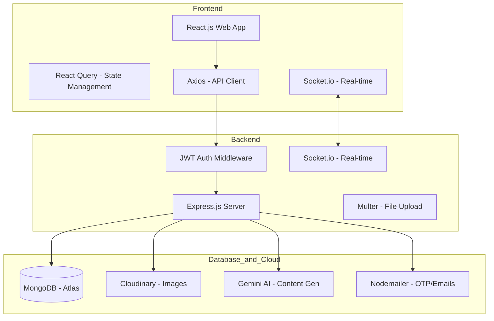
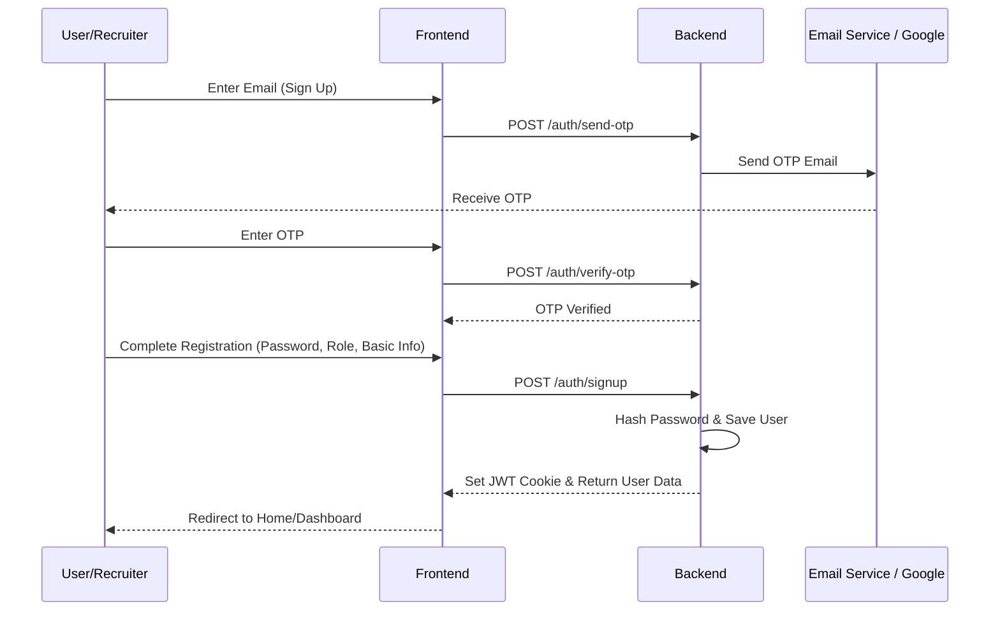
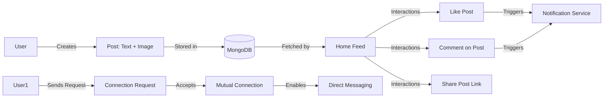
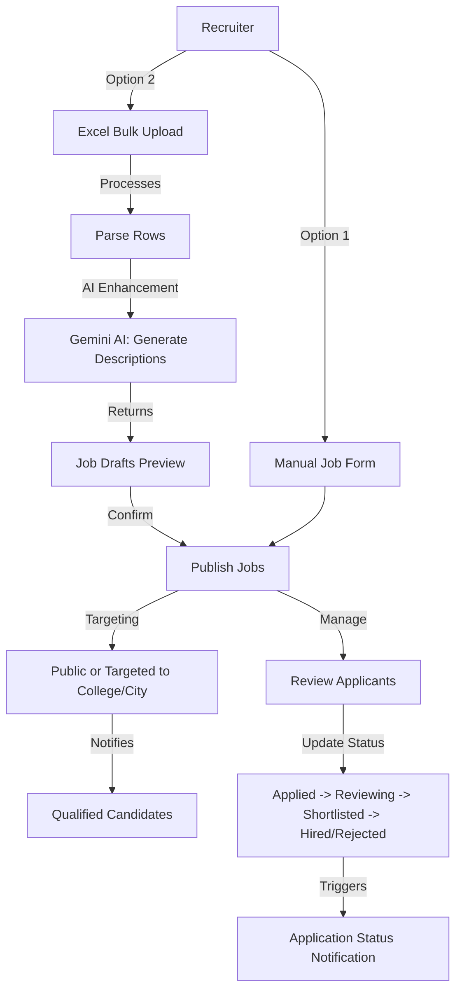
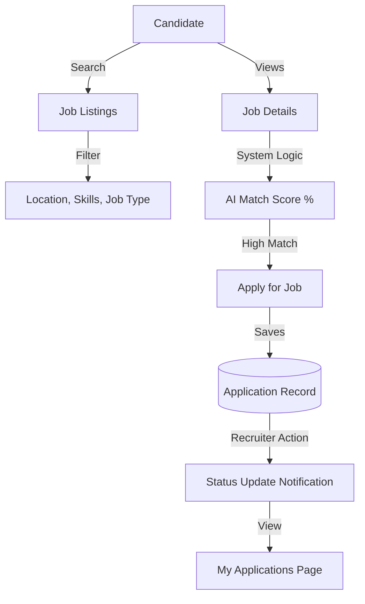
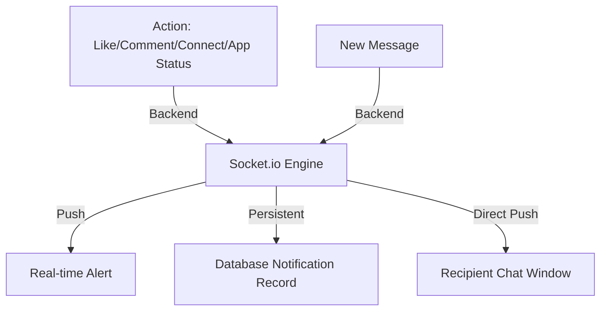

# WORKNET Project Workflow Diagram

This document provides a comprehensive overview of the **WORKNET** platform's workflows, covering user onboarding, networking, job management, and recruiter operations.

## 1. High-Level System Architecture

The project follows a modern MERN stack architecture with additional integrations for AI and media management.

---

## 2. Authentication & User Onboarding

Users can join as either a **Candidate (User)** or a **Recruiter**.

---

## 3. Professional Networking Workflow

The core social loop of the platform.

---

## 4. Job Management Workflow (Recruiter Side)

Recruiters have advanced tools for posting and managing jobs.

---

## 5. Job Application Workflow (Candidate Side)

Candidates search for jobs and track their applications.

---

## 6. Real-time Notifications & Messaging

